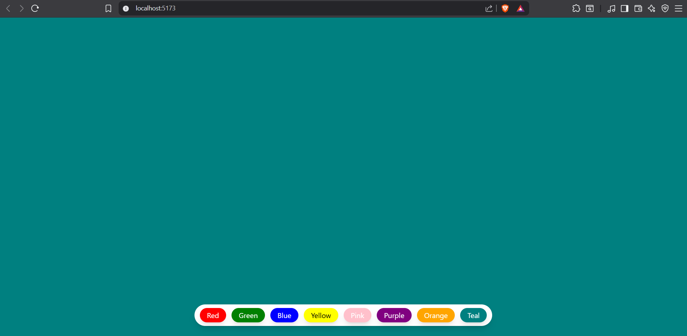

# Background Color Changer 🎨

A simple React application that allows users to dynamically change the background color of the screen by clicking on color buttons.

## 🚀 Features

- Built with React and Tailwind CSS
- Dynamic background color changes with a smooth transition
- Fixed button panel at the bottom with multiple color options
- Responsive layout

## 📸 Demo

> Replace with a real screenshot or a screen recording gif if available

## 🛠️ Tech Stack

- ⚛️ React (Vite)
- 💨 Tailwind CSS
- 🧠 useState React Hook

## 📂 Project Structure

